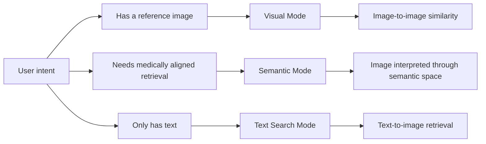
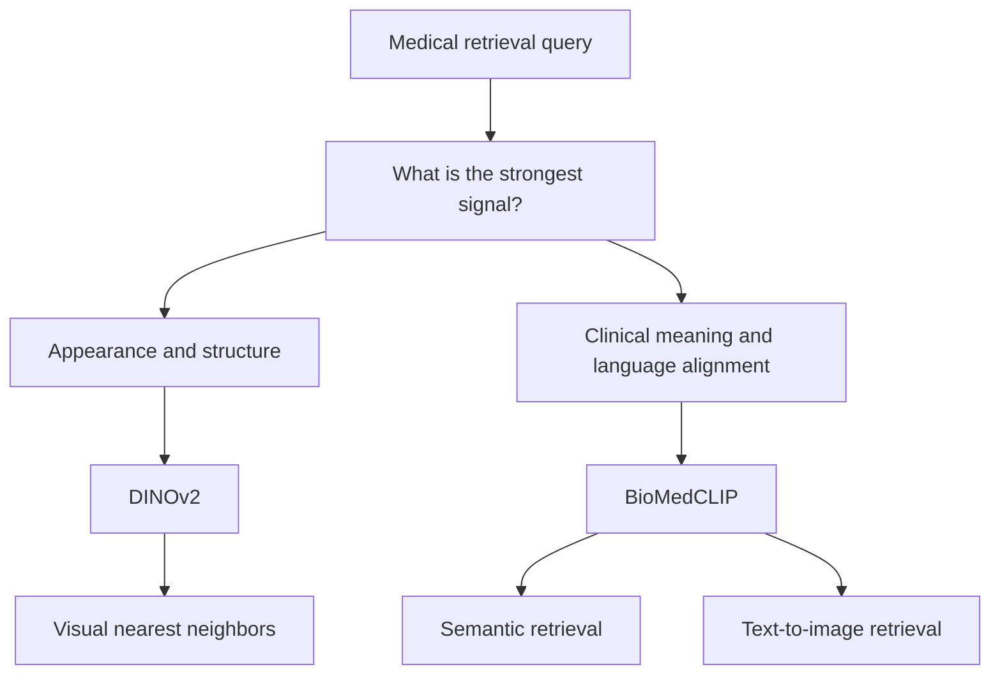
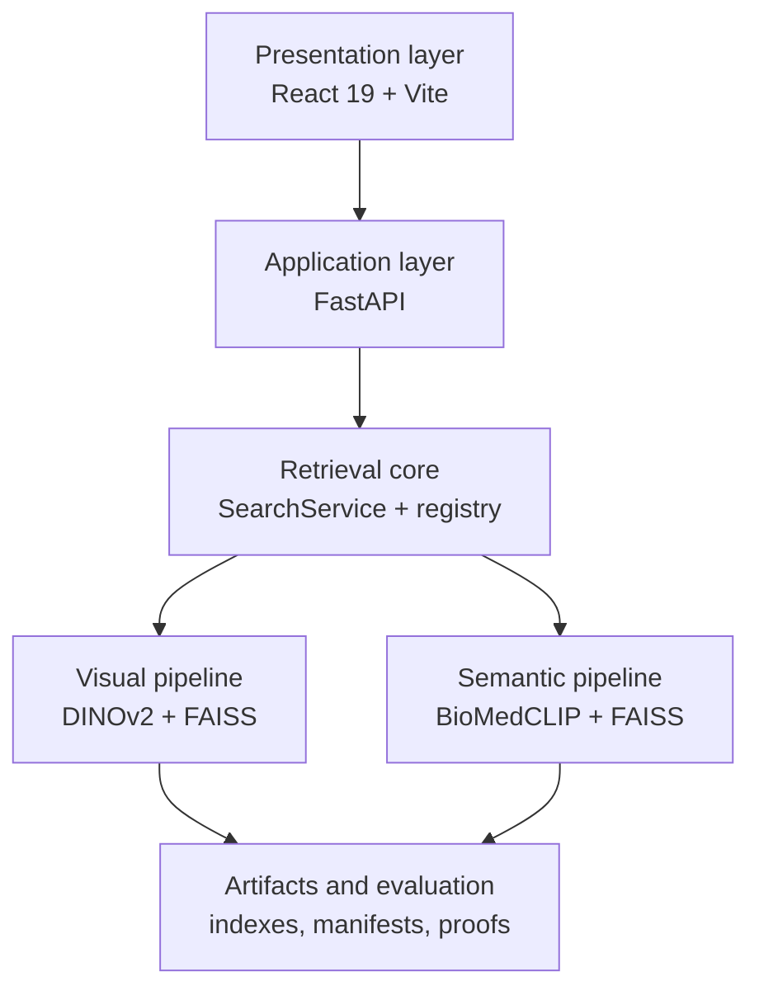
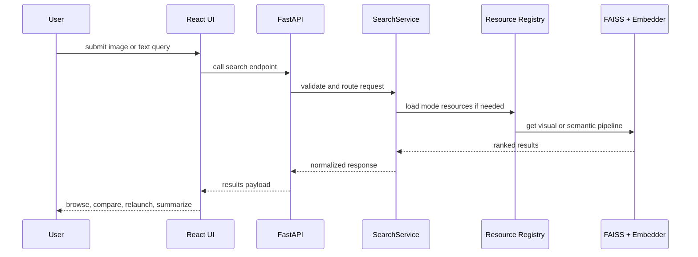

# MediScan AI

<div align="center">
  

  <h2>Multimodal medical retrieval designed as a real product.</h2>

  <p>
    <strong>Non-clinical academic prototype.</strong><br />
    Built to demonstrate end-to-end AI product engineering across retrieval, interface design, backend architecture, and evaluation.
  </p>
</div>

---

## Overview

MediScan AI is a multimodal retrieval platform for medical imaging.

It is designed around a simple idea: a user should be able to move naturally between images, language, and retrieved evidence inside one coherent product experience.

The repository brings together:

- image-to-image retrieval
- semantic retrieval
- text-to-image search
- relaunch from one result or multiple selected results
- AI-assisted synthesis from retrieved cases
- a polished frontend built as a product layer rather than a minimal dashboard

This project is not only a model integration exercise. It is a complete system that combines product thinking, retrieval engineering, backend design, interface execution, and evaluation rigor.

---

## Product Positioning

MediScan AI sits at the intersection of three concerns:

1. medical image retrieval  
It helps surface relevant cases from a large indexed dataset through visual or semantic similarity.

2. AI product design  
It wraps technically complex retrieval logic inside a structured and usable interface.

3. engineering credibility  
It includes a backend API, artifact management, evaluation scripts, metrics, and a repository structure that reflects real system design choices.

The result is a project that reads as a serious AI product prototype rather than a disconnected collection of notebooks or scripts.

---

## The Three Search Modes



### 1. Visual Mode

Visual mode starts from an image query.

Its job is to retrieve cases that are visually close in terms of structure, morphology, composition, and acquisition style. This is the mode to use when the image itself is the strongest signal and the user wants nearest neighbors in visual space.

Typical use cases:

- searching for structurally similar exams
- exploring look-alike cases from a reference scan
- relaunching from one retrieved result to refine a visual neighborhood

### 2. Semantic Mode

Semantic mode is designed for medically aligned retrieval rather than pure visual resemblance.

Instead of asking only “what looks similar?”, it asks “what is semantically relevant in a medical sense?”. This mode is especially useful when anatomy, clinical meaning, and image-language alignment matter more than raw pixel similarity.

Typical use cases:

- finding cases that are conceptually related
- exploring medically relevant neighbors from an image
- moving from interpretation to retrieval, not only from appearance to retrieval

### 3. Text Search Mode

Text search starts from language instead of a reference image.

The user can write a clinical query in free text and retrieve matching image cases through the semantic index. This makes the system useful even when no query image is available.

Typical use cases:

- searching from a clinical description
- moving from wording to visual evidence
- exploring case families from a text-first workflow

---

## Why There Are Two Retrieval Architectures

MediScan AI does not force every workflow into one single embedding strategy.

That decision is deliberate.

Different retrieval problems require different representational strengths, so the product uses two complementary model families:



### DINOv2

DINOv2 is used for the visual retrieval path.

It is well suited for:

- morphology
- texture
- spatial composition
- structural similarity
- visual neighborhood search

In practice, DINOv2 is the right choice when the user begins with an image and wants retrieval driven by appearance and structure.

### BioMedCLIP

BioMedCLIP is used for semantic retrieval and text-to-image search.

It is well suited for:

- image-language alignment
- medically meaningful similarity
- semantic matching across modalities
- text-driven retrieval

In practice, BioMedCLIP is the right choice when the user begins with language, or when retrieval should reflect medical meaning rather than only visual likeness.

### Why This Matters

Using both DINOv2 and BioMedCLIP gives the platform two different retrieval logics:

- one optimized for what looks similar
- one optimized for what means something similar

That is a much stronger product and engineering choice than pretending one embedding space solves every kind of search equally well.

---

## Architecture Summary



At a high level, the system is organized in four layers:

### 1. Presentation layer

A React 19 + Vite frontend provides the product interface.

It handles:

- home and showcase surface
- image search and text search workspaces
- result browsing
- detail and comparison modals
- relaunch workflows
- AI summary presentation
- bilingual user experience

### 2. Application and API layer

A FastAPI backend exposes the retrieval and synthesis capabilities through a clean API surface.

This layer handles:

- request validation
- routing
- service orchestration
- response shaping
- image redirection
- optional contact delivery

### 3. Retrieval core

The retrieval core is implemented around a `SearchService` and a thread-safe resource registry.

This layer handles:

- mode selection
- lazy loading of heavy resources
- FAISS search execution
- text-to-image retrieval
- relaunch from one or multiple image IDs
- centroid-based embedding relaunch

### 4. Artifact and evaluation layer

The project includes stable FAISS artifacts, manifests, indexed metadata, and reproducible evaluation scripts.

This is important because the repository is not only concerned with runtime behavior. It also documents how retrieval quality is measured and how artifacts are managed over time.

---

## Technical Highlights

### Backend Engineering

- FastAPI application with a retrieval-focused API
- lazy initialization of heavy search resources
- thread-safe caching of embedders and FAISS indexes
- structured validation for uploads, text input, modes, and selected image IDs
- optional metadata enrichment pipeline

### Retrieval Engineering

- separate visual and semantic indexes
- explicit stable artifact configuration by mode
- image-to-image retrieval through DINOv2
- text-to-image and semantic retrieval through BioMedCLIP
- relaunch from multiple selected results via centroid embedding

### Frontend Engineering

- React 19 product interface, not a thin admin shell
- multiple search journeys inside one coherent UX
- result detail flow, compare flow, export flow, and AI summary flow
- theme-aware product surface
- bilingual French / English experience

### Engineering Discipline

- one-command startup via `run.sh` and `run.bat`
- Git LFS support for large FAISS artifacts
- test and evaluation separation from runtime logic
- repository structure suited for demo, iteration, and review

---

## Evaluation and Benchmarking

The repository includes a dedicated evaluation layer documented in [`docs/evaluation.md`](docs/evaluation.md).

### Benchmark base

| Item | Value |
|---|---|
| Dataset | ROCOv2 |
| Indexed images | 59,962 |
| Standard benchmark queries | 1,999 |
| Strict annotated subset | 12,251 images |
| Main target metric | `TMO_resultats` |

### Selected results

| Mode | Standard `TMO_resultats` | Strict `TMO_resultats` | Standard `Precision@K (CUI)` |
|---|---:|---:|---:|
| Visual | 40.7% | 86.3% | 92.3% |
| Semantic | 45.7% | 90.4% | 93.9% |

### Why these results matter

- the semantic pipeline outperforms the visual pipeline on the main relevance metric
- the repository includes measurable evidence, not only qualitative claims
- the system already has a serious basis for future fine-tuning and benchmarking work

For more detail, see [`docs/evaluation.md`](docs/evaluation.md) and the supporting files in [`proofs/`](proofs).

---

## API Surface

| Endpoint | Purpose |
|---|---|
| `GET /api/health` | health check |
| `POST /api/search` | image upload retrieval |
| `POST /api/search-text` | text-to-image retrieval |
| `POST /api/search-by-id` | relaunch from one indexed image |
| `POST /api/search-by-ids` | relaunch from multiple selected images |
| `POST /api/generate-conclusion` | AI synthesis generation |
| `POST /api/contact` | contact form delivery |
| `GET /api/images/{image_id}` | redirect to public image asset |



---

## Quick Start

### Prerequisites

- Python `3.11`
- Node.js `>= 20.19.0` or `>= 22.12.0`
- npm
- Git LFS

### Clone and fetch artifacts

```bash
git clone https://github.com/OzanTaskin/mediscan-cbir.git
cd mediscan-cbir
git lfs install
git lfs pull
```

### Configure environment

```bash
cp .env.example .env
```

To enable AI synthesis:

```env
GROQ_KEY_API=your_groq_api_key_here
```

### Run the full project

#### macOS / Linux

```bash
chmod +x run.sh
./run.sh
```

#### Windows

```bat
run.bat
```

### Open the app

- Frontend: `http://127.0.0.1:5173`
- Backend: `http://127.0.0.1:8000`
- Health check: `http://127.0.0.1:8000/api/health`

---

## Developer Commands

### Frontend

```bash
cd frontend
npm ci
npm run dev
npm run lint
npm run build
```

### Backend

```bash
python3.11 -m venv .venv311
source .venv311/bin/activate
pip install -r requirements.txt
PYTHONPATH=src uvicorn backend.app.main:app --host 127.0.0.1 --port 8000
```

### Tests

```bash
pytest
```

---

## Repository Structure

```text
.
├── backend/           FastAPI app, API routes, services, validation
├── frontend/          React product interface
├── src/mediscan/      retrieval runtime, embedders, indexing logic
├── artifacts/         FAISS indexes, ids, manifests
├── scripts/           evaluation and benchmark scripts
├── tests/             Python test suite
├── proofs/            benchmark evidence
├── docs/              supporting documentation
├── run.sh             startup script for macOS / Linux
├── run.bat            startup script for Windows
└── README.md          product-facing overview
```

---

## Why This Repository Works Well on GitHub

This repository presents a strong technical profile because it shows more than isolated implementation skills.

It shows the ability to:

- design a product around AI retrieval
- choose different model architectures for different search problems
- build a usable interface around technically dense workflows
- structure backend and retrieval logic cleanly
- support claims with evaluation and benchmarks
- present the whole system clearly for review, demo, or portfolio use

For a recruiter, professor, collaborator, or technical reviewer, this reads as a serious AI product engineering project rather than a minimal proof of concept.

---

## Disclaimer

MediScan AI is a **non-clinical academic prototype**.

It is intended for experimentation, retrieval research, interface design, and AI product engineering demonstration. It must not be used as a medical device or as a substitute for clinical judgment.
