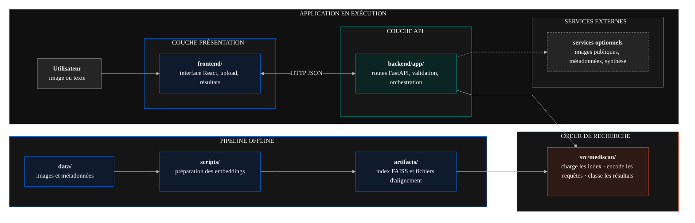

# MEDISCAN AI

<div align="center">
  

  <h3>Plateforme de recherche multimodale pour images médicales.</h3>

  <p>
    MEDISCAN AI permet de rechercher, comparer et explorer des images médicales à partir d'une image, d'une requête textuelle ou d'une représentation sémantique.
  </p>

  <p>
    <strong>Prototype académique non clinique.</strong><br />
    Ce dépôt sert à expérimenter un système de recherche d'images médicales. Il ne doit pas être utilisé comme dispositif médical ni comme outil de diagnostic.
  </p>

  <p>
    
    
    
    
    
    
    
    
    
    
    
    
  </p>

  <p>
    <strong>Top contributors</strong>
  </p>

  <p>
    <a href="https://github.com/MediscanAI-cbir/mediscan-cbir/graphs/contributors">
      
    </a>
  </p>
</div>

## Présentation

> Cette section introduit le projet, son objectif général et les trois façons d'interroger la base d'images médicales.

MEDISCAN AI est un prototype académique dédié à la recherche d'images médicales. L'application permet d'interroger une base d'images à partir d'une image de référence, d'une requête textuelle ou d'une représentation sémantique.

Le projet étudie l'utilisation de modèles visuels et multimodaux pour explorer une collection d'images médicales. L'application regroupe l'upload, l'affichage des résultats, les filtres, la comparaison, la relance de recherche et la synthèse assistée.

Le projet couvre quatre aspects :

- exploration rapide de bases d'images médicales ;
- comparaison visuelle et sémantique des résultats ;
- interface utilisateur autour d'un moteur de recherche IA ;
- code exécutable localement avec frontend, backend, index et scripts d'évaluation.

En combinant recherche par image, recherche par texte, modèles multimodaux et interface utilisateur, MEDISCAN AI montre comment organiser un système de retrieval médical de bout en bout.

Trois types de recherche sont proposés :

- recherche par image, pour retrouver des images visuellement similaires ;
- recherche sémantique, pour identifier des images médicalement proches ;
- recherche par texte, pour retrouver des images correspondant à une description ou à une intention clinique.

## Documentation

La documentation du projet peut être générée dans un portail unique :

```bash
python scripts/generate_docs.py
```

Ou via le raccourci shell du projet :

```bash
./bin/run.sh docs
```

Le portail généré se trouve ici :

```text
docs/index.html
```

## Démo de l'application

> Cette section montre le parcours utilisateur en conditions réelles, depuis le choix du mode de recherche jusqu'à la synthèse assistée.

[Voir la vidéo de démonstration sur YouTube](https://youtu.be/sy-FLL0Jk4w)


La vidéo montre un scénario d'utilisation :

1. Choix du mode de recherche.
2. Import d'une image médicale ou saisie d'une requête textuelle.
3. Affichage des résultats.
4. Exploration et comparaison des images.
5. Relance de recherche depuis un ou plusieurs résultats.
6. Génération d'une synthèse assistée par LLM.

## 1. Fonctionnalités

> Cette section résume les actions principales disponibles dans l'interface.

### 1.1 Vue d'ensemble

> Cette sous-section présente le parcours général côté utilisateur.

MEDISCAN AI permet de rechercher, comparer et explorer des images médicales sans manipuler directement les modèles ou les index.

**Actions principales :**

- rechercher par image ou par texte ;
- parcourir, filtrer et inspecter les résultats ;
- relancer une recherche depuis un résultat ou une sélection ;
- générer une synthèse assistée et restituer les résultats.

L'interface transmet les requêtes au backend, récupère les résultats classés et affiche les métadonnées utiles.

### 1.2 Modes de recherche

> Cette sous-section présente les trois manières d'interroger la base.

<table border="1" cellpadding="12" cellspacing="0">
  <tr>
    <td width="33%" valign="top">
      
      <br /><br />
      <strong>Similarité visuelle</strong><br />
      Entrée : image médicale<br />
      Résultat : images proches par apparence.
    </td>
    <td width="33%" valign="top">
      
      <br /><br />
      <strong>Proximité sémantique</strong><br />
      Entrée : image médicale<br />
      Résultat : images proches en signification médicale.
    </td>
    <td width="33%" valign="top">
      
      <br /><br />
      <strong>Recherche par description</strong><br />
      Entrée : requête textuelle<br />
      Résultat : images alignées avec le texte.
    </td>
  </tr>
</table>

### 1.3 Fonctionnalités principales

> Cette sous-section regroupe les fonctionnalités par grandes familles.

<table border="1" cellpadding="14" cellspacing="0">
  <tr>
    <td width="50%" valign="top">
      
      <br /><br />
      <strong>Upload d'image médicale</strong><br />
      Import d'une image de référence.
      <br /><br />
      <strong>Recherche visuelle, sémantique et texte-vers-image</strong><br />
      Trois modes pour explorer la base.
      <br /><br />
      <strong>Filtres et catégories</strong><br />
      Affinage par score, caption, CUI, type médical ou référence.
    </td>
    <td width="50%" valign="top">
      
      <br /><br />
      <strong>Grille de résultats</strong><br />
      Résultats classés, paginés et faciles à comparer.
      <br /><br />
      <strong>Vue détaillée</strong><br />
      Inspection d'une image avec ses informations utiles.
      <br /><br />
      <strong>Relance depuis un ou plusieurs résultats</strong><br />
      Nouvelle recherche à partir d'un résultat ou d'une sélection.
    </td>
  </tr>
  <tr>
    <td width="50%" valign="top">
      
      <br /><br />
      <strong>Conclusion assistée par LLM</strong><br />
      Résumé exploratoire généré à partir des résultats.
      <br /><br />
      <strong>Export et partage</strong><br />
      Restitution des résultats pour comparaison, revue ou présentation.
    </td>
    <td width="50%" valign="top">
      
      <br /><br />
      <strong>Interface bilingue</strong><br />
      Consultation en plusieurs langues.
      <br /><br />
      <strong>Thème clair / sombre</strong><br />
      Adaptation visuelle au contexte d'usage.
      <br /><br />
      <strong>Parcours d'utilisation</strong><br />
      Parcours continu de l'upload à la synthèse.
    </td>
  </tr>
</table>

### 1.4 Fonctionnalités mises en avant

> Cette sous-section détaille les étapes clés du parcours d'exploration.

#### 1. Grille de résultats paginée

Après une recherche, les images sont affichées dans une grille paginée, classées par similarité. Chaque résultat présente les informations essentielles : rang, image, score, caption et identifiant.

#### 2. Filtres de résultats

Les filtres affinent la liste déjà retournée par le moteur de recherche. Ils ne recalculent pas les embeddings : ils servent à réduire ou organiser les résultats visibles.

Principaux filtres :

- **caption et suggestions** : recherche de termes dans les légendes et propositions de mots utiles ;
- **CUI et type médical** : filtrage par concepts UMLS, anatomie, modalité ou finding ;
- **score et tri** : seuil minimum et ordre des résultats ;
- **référence image** : recherche ciblée d'un identifiant précis, par exemple `ROCO_000123`.

En pratique, l'utilisateur peut partir d'une recherche large, choisir une catégorie médicale, puis affiner avec un terme issu des captions et un score minimum.

#### 3. Relance de recherche

La relance transforme un résultat intéressant, ou une sélection de plusieurs images, en nouvelle requête. Dans le cas d'une sélection multiple, les embeddings sont moyennés pour représenter la tendance commune du groupe.

Cas d'utilisation :

- approfondir une piste après avoir trouvé une image pertinente ;
- chercher des cas proches d'un groupe d'images similaires ;
- passer d'une exploration large à une recherche plus ciblée.

#### 4. Conclusion LLM

La conclusion LLM génère une synthèse prudente à partir des captions des images similaires. Elle aide à résumer les motifs récurrents, sans poser de diagnostic ni remplacer un avis médical. Elle nécessite une clé Groq configurée dans `.env`.

#### 5. Export et partage

Les résultats peuvent être conservés ou partagés pour garder une trace de l'exploration, préparer une comparaison ou présenter une sélection. Cette restitution ne constitue pas un compte rendu médical.

## 2. Architecture technique

> Cette section explique comment le frontend, le backend, les modèles d'embedding et les index FAISS fonctionnent ensemble.

### 2.1 Vue d'ensemble

> Cette sous-section présente l'architecture logicielle du projet : frontend, backend, services, coeur de retrieval, artifacts et services externes.

MEDISCAN AI est structuré comme une application complète. Le frontend React gère l'interface, le backend FastAPI valide les requêtes et orchestre les ressources, puis le moteur de retrieval interroge des index FAISS déjà construits.



Le backend charge les ressources de recherche via une registry partagée. Les index FAISS, les métadonnées d'images et les modèles sont donc utilisés de façon cohérente entre les routes API, les scripts CLI et les évaluations.

### 2.2 Stack technique

> Cette sous-section résume les principales briques techniques utilisées dans le projet et leur rôle.

<table border="0" cellpadding="0" cellspacing="0">
  <tr>
    <td width="50%" valign="top">
      <ul>
        <li style="margin-bottom: 12px;">
          &nbsp;&nbsp;&nbsp;&nbsp;Python
        </li>
        <li style="margin-bottom: 12px;">
          &nbsp;&nbsp;&nbsp;&nbsp;React
        </li>
        <li style="margin-bottom: 12px;">
          &nbsp;&nbsp;&nbsp;&nbsp;API FastAPI
        </li>
      </ul>
    </td>
    <td width="50%" valign="top">
      <ul>
        <li style="margin-bottom: 12px;">
          &nbsp;&nbsp;&nbsp;&nbsp;PyTorch
        </li>
        <li style="margin-bottom: 12px;">
          &nbsp;&nbsp;&nbsp;&nbsp;BioMedCLIP / Hugging Face ROCOv2
        </li>
        <li style="margin-bottom: 12px;">
          &nbsp;&nbsp;&nbsp;&nbsp;Meta FAISS / DINOv2
        </li>
      </ul>
    </td>
  </tr>
</table>

### 2.3 Trois chemins de retrieval

> Cette sous-section compare les trois chemins d'encodage et de recherche selon le type de requête.

Les trois modes partagent la même logique générale, mais pas le même encodeur.

| Mode | Entrée | Encodeur | Index | Objectif |
|---|---|---|---|---|
| Visual Analysis | Image médicale | `dinov2_base` | `artifacts/index.faiss` | Retrouver des images visuellement similaires |
| Interpretive Analysis | Image médicale | `biomedclip` fine-tuné | `artifacts/index_semantic.faiss` | Retrouver des images proches en signification médicale |
| Text Query | Texte médical | `biomedclip` fine-tuné | `artifacts/index_semantic.faiss` | Retrouver des images alignées avec une description |

```text
Visual Analysis
image -> preprocessing DINOv2 -> embedding 768D -> FAISS visual -> résultats

Interpretive Analysis
image -> preprocessing BioMedCLIP -> embedding 512D -> FAISS semantic -> résultats

Text Query
texte -> tokenizer BioMedCLIP -> embedding 512D -> FAISS semantic -> résultats
```

### 2.4 Fine-tuning BioMedCLIP sur ROCOv2

> Cette sous-section explique pourquoi la branche sémantique repose sur un BioMedCLIP adapté au dataset ROCOv2.

La branche sémantique utilise un modèle BioMedCLIP fine-tuné sur ROCOv2 :

```text
hf-hub:Ozantsk/biomedclip-rocov2-finetuned
```

Ce modèle est une version de BioMedCLIP adaptée au domaine de MEDISCAN AI. Il conserve l'architecture multimodale image/texte de BioMedCLIP, mais ses poids ont été ajustés avec des couples image-caption issus de ROCOv2 afin de mieux représenter les images médicales du projet.

Il est utilisé pour deux tâches :

- encoder une image médicale en vecteur sémantique ;
- encoder une requête textuelle en vecteur dans le même espace latent.

L'intérêt du fine-tuning est d'adapter BioMedCLIP au vocabulaire, aux captions et aux distributions visuelles du dataset ROCOv2. Un modèle multimodal général peut déjà aligner texte et image, mais le modèle fine-tuné apprend un espace vectoriel plus proche du domaine réellement utilisé ici : radiographies, CT, IRM, échographies, légendes médicales et concepts associés.

Le point critique est la cohérence entre modèle et index. L'index sémantique n'est pas interrogé avec un modèle différent de celui qui l'a construit. Il a été reconstruit avec les embeddings produits par le modèle fine-tuné :

```text
BioMedCLIP fine-tuné ROCOv2
  |
  +--> encode toutes les images du dataset
  |
  +--> construit artifacts/index_semantic.faiss
  |
  +--> sert aussi aux requêtes image et texte à l'exécution
```

Cette cohérence évite une erreur classique en retrieval : générer une requête avec un espace d'embedding différent de celui de l'index. Le modèle fine-tuné définit l'espace de comparaison ; les images indexées, les requêtes image et les requêtes texte doivent donc être encodées par ce même modèle pour que les distances FAISS restent interprétables.

### 2.5 Modèles utilisés

> Cette sous-section précise les modèles employés, leurs dimensions d'embedding et leur usage dans MEDISCAN AI.

| Modèle | Dimension | Utilisation | Pourquoi |
|---|---:|---|---|
| `facebook/dinov2-base` | 768 | Visual Analysis | Extracteur de caractéristiques visuelles générales, utilisé pour formes, textures et structures |
| `hf-hub:Ozantsk/biomedclip-rocov2-finetuned` | 512 | Interpretive Analysis + Text Query | Espace multimodal médical, aligné image/texte et adapté au dataset ROCOv2 |

DINOv2 et BioMedCLIP ne cherchent pas la même chose. DINOv2 privilégie la proximité visuelle. BioMedCLIP privilégie une proximité plus interprétative : captions, contexte médical, anatomie, modalité et signification clinique.

### 2.6 Index et artifacts

> Cette sous-section détaille les fichiers stables nécessaires à la recherche FAISS.

Les artifacts stables sont stockés dans `artifacts/`. Les manifests indiquent l'encodeur, la dimension, le nombre de vecteurs et le statut de validation.

| Artifact | Mode | Contenu |
|---|---|---|
| `artifacts/index.faiss` | Visual Analysis | Index FAISS visuel DINOv2 |
| `artifacts/ids.json` | Visual Analysis | Métadonnées alignées avec l'index visuel |
| `artifacts/index_semantic.faiss` | Interpretive + Text | Index FAISS BioMedCLIP fine-tuné |
| `artifacts/ids_semantic.json` | Interpretive + Text | Métadonnées alignées avec l'index sémantique |
| `artifacts/manifests/visual_stable.json` | Visual Analysis | Manifest validé : `59,962` vecteurs, dimension `768` |
| `artifacts/manifests/semantic_stable.json` | Interpretive + Text | Manifest validé : `59,962` vecteurs, dimension `512` |

Le manifest sémantique précise que l'index a été reconstruit sur le dataset complet et vérifié avec les embeddings du BioMedCLIP fine-tuné ROCOv2.

### 2.7 Données, artifacts et Git LFS

> Cette sous-section distingue les fichiers versionnés, les ressources locales et les données volumineuses récupérées avec Git LFS.

Le moteur de recherche dépend de plusieurs familles de fichiers :

| Ressource | Chemin | Statut |
|---|---|---|
| Index FAISS stables | `artifacts/index.faiss`, `artifacts/index_semantic.faiss` | Suivis avec Git LFS. |
| Métadonnées indexées | `artifacts/ids.json`, `artifacts/ids_semantic.json` | Alignées ligne par ligne avec les vecteurs FAISS. |
| Dataset local complet | `data/roco_train_full/metadata.csv` et images associées | Ressource locale, non versionnée dans Git. |
| Ground truth d'évaluation | `artifacts/ground_truth/` | Ressource locale utilisée par certaines évaluations. |
| Preuves d'évaluation | `proofs/perf/` | Sorties locales ou livrables séparés selon le mode de partage du projet. |

Les fichiers `.faiss` sont volumineux et doivent être récupérés avec Git LFS :

```bash
git lfs install
git lfs pull
```

Après récupération, les manifests permettent de vérifier que les index attendus sont bien présents. Les fichiers `ids*.json` contiennent les informations nécessaires pour afficher les résultats : `image_id`, chemin d'origine, caption et CUI.

Si `data/roco_train_full/metadata.csv` n'est pas disponible localement, l'application peut toujours interroger les index déjà construits, mais la reconstruction complète des index n'est pas possible. Les recherches par ID et l'affichage des images utilisent les URLs publiques Hugging Face construites depuis les identifiants ROCOv2.

Le dossier `proofs/` et certains scripts d'évaluation peuvent être exclus du suivi Git selon la configuration locale. Dans ce cas, les métriques du README restent des résultats de référence, mais les CSV correspondants doivent être fournis séparément ou régénérés.

### 2.8 Pipeline de recherche

> Cette sous-section décrit les étapes qui transforment une requête utilisateur en résultats affichés dans l'interface.

Le pipeline suit le même contrat côté API et côté scripts :

```text
1. Requête utilisateur
   - image uploadée
   - image_id existant
   - liste d'image_id
   - texte médical

2. Validation backend
   - format image
   - k entre 1 et 50
   - mode visual / semantic
   - texte non vide

3. Encodage
   - DINOv2 pour Visual Analysis
   - BioMedCLIP fine-tuné pour Interpretive Analysis
   - encode_text BioMedCLIP pour Text Query

4. Normalisation
   - vecteurs float32
   - normalisation L2

5. Recherche FAISS
   - top-k voisins
   - exclusion optionnelle de l'image source
   - recherche par centroïde pour plusieurs images

6. Enrichissement
   - caption
   - CUI
   - image_id
   - score de similarité

7. Réponse API
   - résultats classés
   - affichage dans la grille React
```

### 2.9 API backend

> Cette sous-section liste les endpoints exposés par FastAPI pour la recherche, la relance, les images, la conclusion et le contact.

| Endpoint | Méthode | Rôle |
|---|---|---|
| `/api/health` | `GET` | Vérifie que le backend est disponible |
| `/api/search` | `POST` | Recherche par image uploadée, en mode `visual` ou `semantic` |
| `/api/search-text` | `POST` | Recherche texte-vers-image via BioMedCLIP fine-tuné |
| `/api/search-by-id` | `POST` | Relance une recherche depuis une image déjà indexée |
| `/api/search-by-ids` | `POST` | Relance par centroïde à partir de plusieurs images sélectionnées |
| `/api/generate-conclusion` | `POST` | Génère une synthèse prudente à partir des résultats |
| `/api/contact` | `POST` | Envoie un message de contact si SMTP est configuré |
| `/api/images/{image_id}` | `GET` | Redirige vers l'image ROCOv2 publique |

### 2.10 Contrats API

> Cette sous-section donne des exemples de payloads et de réponses pour les principales routes backend.

Les endpoints retournent des réponses JSON validées par Pydantic. Les résultats partagent la même structure générale :

```json
{
  "mode": "visual",
  "embedder": "dinov2_base",
  "results": [
    {
      "rank": 1,
      "image_id": "ROCOv2_2023_train_000001",
      "score": 0.823,
      "path": "https://huggingface.co/datasets/Mediscan-Team/mediscan-data/resolve/main/images_01/ROCOv2_2023_train_000001.png",
      "caption": "Medical image caption",
      "cui": "C000000"
    }
  ]
}
```

Selon la route appelée, la réponse ajoute aussi le champ de requête correspondant : `query_image`, `query_text`, `query_image_id` ou `query_image_ids`.

Recherche par image uploadée :

```bash
curl -X POST http://127.0.0.1:8000/api/search \
  -F "image=@query.png" \
  -F "mode=visual" \
  -F "k=5"
```

Champs attendus :

| Champ | Type | Rôle |
|---|---|---|
| `image` | fichier multipart | Image de requête au format PNG ou JPEG. |
| `mode` | `visual` ou `semantic` | Choix entre DINOv2 et BioMedCLIP. |
| `k` | entier | Nombre de résultats, entre `1` et `50`. |

Recherche texte-vers-image :

```http
POST /api/search-text
{
  "text": "chest X-ray with bilateral lower lobe opacities",
  "k": 10
}
```

Relance depuis une image indexée :

```http
POST /api/search-by-id
{
  "image_id": "ROCOv2_2023_train_000123",
  "mode": "semantic",
  "k": 10
}
```

Relance depuis plusieurs images sélectionnées :

```http
POST /api/search-by-ids
{
  "image_ids": [
    "ROCOv2_2023_train_000123",
    "ROCOv2_2023_train_000124"
  ],
  "mode": "visual",
  "k": 10
}
```

La relance multiple calcule un centroïde : les embeddings des images sélectionnées sont moyennés, normalisés, puis utilisés comme nouvelle requête FAISS.

Synthèse assistée :

```http
POST /api/generate-conclusion
{
  "mode": "semantic",
  "embedder": "biomedclip",
  "results": [
    {
      "rank": 1,
      "image_id": "ROCOv2_2023_train_000123",
      "score": 0.82,
      "caption": "Medical caption"
    }
  ]
}
```

Cette route nécessite `GROQ_KEY_API`. Elle produit une synthèse prudente en anglais, limitée aux captions fournies, et ne formule pas de diagnostic.

Formulaire de contact :

```http
POST /api/contact
{
  "name": "Nom",
  "email": "user@example.com",
  "subject": "Sujet",
  "message": "Message"
}
```

Cette route nécessite une configuration SMTP complète. Si SMTP n'est pas configuré, l'API retourne une erreur de service indisponible plutôt que d'ignorer le message.

Codes d'erreur courants :

| Code | Cas typique |
|---:|---|
| `400` | Paramètre invalide : mode inconnu, image invalide, texte vide, identifiant incorrect. |
| `413` | Image uploadée au-dessus de la limite configurée. |
| `502` | Envoi SMTP impossible malgré une configuration présente. |
| `503` | Ressources de recherche, synthèse LLM ou email indisponibles. |

### 2.11 Évaluation et preuves

> Cette sous-section explique les métriques de référence et les fichiers nécessaires pour reproduire les évaluations.

Le projet documente des CSV de preuve dans `proofs/perf/`. Ils mesurent le comportement du retrieval sur des requêtes évaluées. Selon le mode de partage du dépôt, ce dossier peut être fourni séparément ou régénéré localement, car les sorties de preuve sont souvent exclues du suivi Git.

| Évaluation | Requêtes | Résultat |
|---|---:|---|
| Semantic strict modèle fine-tuné, `k=10` | `9,140` | `TM requêtes 91.29%`, `TA requêtes 90.70%`, `TMO requêtes 88.88%` |
| Semantic strict baseline, `k=10` | `9,140` | `TM requêtes 90.97%`, `TA requêtes 90.40%`, `TMO requêtes 88.58%` |
| Text Query caption, `k=10` | `100` | `Precision@k 77.00%`, `Top-1 hit 100.00%` |
| Text Query keyword, `k=10` | `100` | `Precision@k 39.30%`, `Top-1 hit 86.00%` |

Abréviations utilisées par l'évaluation stricte :

- `TM` : même modalité ;
- `TA` : même anatomie / organe ;
- `TMO` : même modalité et même organe.

Les métriques montrent surtout que le modèle fine-tuné améliore les taux au niveau requête sur les critères stricts, tout en conservant des résultats proches au niveau résultats. Le test texte par caption valide l'alignement image-texte du modèle fine-tuné ; le test keyword est volontairement plus sévère, car il exige une correspondance lexicale explicite.

Les évaluations strictes s'appuient sur des fichiers de ground truth locaux :

```text
artifacts/ground_truth/ROCOv2_GLOABL_modality.csv
artifacts/ground_truth/ROCOv2_GLOABL_organ.csv
artifacts/ground_truth/ROCOv2_GLOABL_mo.csv
```

Ces fichiers servent à vérifier si les résultats partagent la même modalité, la même anatomie ou le même couple modalité-organe. Si les fichiers ne sont pas présents, les commandes d'évaluation strictes ne peuvent pas être relancées telles quelles.

## 3. Lancer le code en local

> Cette section regroupe les prérequis, la configuration `.env`, les commandes de lancement, les tests et les évaluations.

Le dépôt peut être lancé localement avec le script `bin/run.sh`. Il vérifie les prérequis, crée l'environnement Python `.venv311` si nécessaire, installe les dépendances frontend avec `npm ci`, démarre le backend FastAPI puis lance le frontend Vite.

Prérequis :

- Python `3.11` ;
- Node.js `>=20.19.0` ou `>=22.12.0` ;
- npm ;
- Git LFS pour récupérer les index FAISS.

Installation puis lancement :

```bash
git lfs install
git lfs pull
cp .env.example .env
./bin/run.sh
```

Sous Windows, le dépôt fournit aussi `bin/run.bat`.

URLs locales :

| Service | URL |
|---|---|
| Frontend | `http://127.0.0.1:5173` |
| Backend | `http://127.0.0.1:8000` |
| Health check | `http://127.0.0.1:8000/api/health` |

### Configuration `.env`

Le fichier `.env.example` liste les variables utilisées par le backend. Pour une installation locale minimale, il suffit de copier le fichier :

```bash
cp .env.example .env
```

Variables backend principales :

Un exemple complet pour l'environnement de production est disponible dans
`production.env.example`. Les vraies valeurs secrètes doivent être injectées par
la plateforme de déploiement, pas commitées dans le dépôt.

| Variable | Obligatoire | Rôle |
|---|---|---|
| `BACKEND_PORT` | Non | Port FastAPI utilisé par les scripts de lancement. Valeur par défaut : `8000`. |
| `MEDISCAN_CORS_ORIGINS` | Non | Origines frontend autorisées à appeler l'API. |
| `MEDISCAN_MAX_UPLOAD_BYTES` | Non | Taille maximale d'une image uploadée. Valeur par défaut : `10485760` octets, soit 10 Mo. |
| `MEDISCAN_REMOTE_IMAGE_TIMEOUT_SECONDS` | Non | Timeout pour télécharger une image ROCOv2 distante lors des recherches par ID. |
| `MEDISCAN_TORCH_THREADS` | Non | Nombre de threads CPU utilisés par PyTorch. |
| `MEDISCAN_RATE_LIMIT_WINDOW_SECONDS` | Non | Fenêtre de quota par IP. Valeur par défaut : `60`. |
| `MEDISCAN_RATE_LIMIT_SEARCH` | Non | Nombre de recherches image autorisées par IP et par fenêtre. Valeur par défaut : `12`. |
| `MEDISCAN_RATE_LIMIT_SEARCH_TEXT` | Non | Nombre de recherches texte autorisées par IP et par fenêtre. Valeur par défaut : `20`. |
| `MEDISCAN_RATE_LIMIT_SEARCH_BY_ID` | Non | Nombre de relances par image autorisées par IP et par fenêtre. Valeur par défaut : `30`. |
| `MEDISCAN_RATE_LIMIT_SEARCH_BY_IDS` | Non | Nombre de recherches multi-images autorisées par IP et par fenêtre. Valeur par défaut : `10`. |
| `MEDISCAN_RATE_LIMIT_CONCLUSION` | Non | Nombre de synthèses IA autorisées par IP et par fenêtre. Valeur par défaut : `5`. |
| `MEDISCAN_RATE_LIMIT_CONTACT` | Non | Nombre de messages de contact autorisés par IP et par fenêtre. Valeur par défaut : `3`. |
| `MEDISCAN_SEARCH_CONCURRENCY_LIMIT` | Non | Nombre maximum de traitements de recherche simultanés par instance. Valeur par défaut : `2`. |
| `MEDISCAN_CONCLUSION_CONCURRENCY_LIMIT` | Non | Nombre maximum d'appels de synthèse IA simultanés par instance. Valeur par défaut : `2`. |
| `MEDISCAN_CONTACT_CONCURRENCY_LIMIT` | Non | Nombre maximum d'envois SMTP simultanés par instance. Valeur par défaut : `5`. |
| `MEDISCAN_TRUST_PROXY_HEADERS` | Non | Utilise `X-Forwarded-For` pour identifier les clients uniquement derrière un proxy de confiance. Valeur par défaut : `false`. |
| `MONGO_URI` | Non | Active l'enrichissement optionnel des résultats depuis MongoDB. |
| `MEDISCAN_MONGO_SERVER_SELECTION_TIMEOUT_MS` | Non | Timeout court pour sélectionner un serveur MongoDB. Valeur par défaut : `2000`. |
| `MEDISCAN_MONGO_CONNECT_TIMEOUT_MS` | Non | Timeout court pour ouvrir la connexion MongoDB. Valeur par défaut : `2000`. |
| `GROQ_KEY_API` | Non | Active la synthèse assistée par LLM. Sans clé, la recherche reste fonctionnelle. |
| `MEDISCAN_GROQ_MODEL` | Non | Modèle Groq utilisé pour la synthèse. |
| `MEDISCAN_MAX_CONCLUSION_RESULTS` | Non | Nombre maximum de résultats injectés dans la synthèse LLM. |
| `MEDISCAN_SMTP_HOST` | Oui pour contact | Serveur SMTP du formulaire de contact. |
| `MEDISCAN_SMTP_PORT` | Oui pour contact | Port SMTP, souvent `587` en TLS ou `465` en SSL. |
| `MEDISCAN_SMTP_USERNAME` | Oui pour contact | Identifiant SMTP. |
| `MEDISCAN_SMTP_PASSWORD` | Oui pour contact | Mot de passe ou token SMTP. |
| `MEDISCAN_SMTP_USE_TLS` | Non | Active STARTTLS. Valeur locale par défaut : `true`. |
| `MEDISCAN_SMTP_USE_SSL` | Non | Active SSL direct. Ne doit pas être activé en même temps que TLS. |
| `MEDISCAN_CONTACT_FROM_EMAIL` | Oui pour contact | Adresse expéditrice utilisée par le serveur SMTP. |
| `MEDISCAN_CONTACT_TO_EMAIL` | Oui pour contact | Adresse qui reçoit les messages du formulaire. |
| `MEDISCAN_CONTACT_REPLY_TO_EMAIL` | Non | Adresse reply-to par défaut si nécessaire. |
| `DATA_DIR` | Non | Chemin indicatif documenté dans `.env.example` pour localiser le dataset si le code est adapté. |
| `ARTIFACTS_DIR` | Non | Chemin indicatif documenté dans `.env.example` pour localiser les artifacts si le code est adapté. |

Variables frontend disponibles dans `frontend/.env.example` :

| Variable | Rôle |
|---|---|
| `VITE_API_BASE` | Préfixe API utilisé par le frontend. Par défaut : `/api`. |
| `VITE_BACKEND_ORIGIN` | Origine backend utilisée par le proxy Vite en développement local. |

La synthèse assistée nécessite une clé Groq dans `.env` :

```env
GROQ_KEY_API=your_groq_api_key_here
```

Le formulaire de contact nécessite une configuration SMTP complète. Sans SMTP, l'interface peut afficher le formulaire, mais l'envoi retournera une erreur côté API.

### Commandes développeur

Frontend :

```bash
cd frontend
npm ci
npm run dev
npm run build
npm run lint
```

Le script `bin/run.sh` lance Vite sur `http://127.0.0.1:5173`. Si `npm run dev` est exécuté directement depuis `frontend/`, Vite peut utiliser le port défini dans `frontend/vite.config.js`.

Backend :

```bash
python3.11 -m venv .venv311
source .venv311/bin/activate
pip install -r requirements.lock.txt
PYTHONPATH=src uvicorn backend.app.main:app --host 127.0.0.1 --port 8000
```

`requirements.txt` garde les plages de dépendances lisibles pour le développement.
`requirements.lock.txt` fige les versions exactes à installer en production.

Checks production :

```bash
curl http://127.0.0.1:8000/api/health
curl http://127.0.0.1:8000/api/ready
```

`/api/health` vérifie seulement que le processus répond. `/api/ready` vérifie les
artifacts FAISS/IDs, MongoDB si `MONGO_URI` est configuré, et expose aussi l'état
de configuration LLM/SMTP sans révéler les secrets.

Tests :

```bash
pytest
```

Les tests couvrent les briques principales : validation des entrées, API FastAPI, gestion des images, embedders, recherche FAISS, recherche texte, construction d'index et runtime partagé.

Évaluations :

```bash
PYTHONPATH=src python scripts/evaluation/evaluate_strict.py --mode semantic --k 10 --n-queries 9140 --seed 42
PYTHONPATH=src python scripts/evaluation/evaluate_text.py --mode both --k 10 --n-queries 100 --seed 42
```

Les évaluations dépendent des index stables, des métadonnées et, pour l'évaluation stricte, des fichiers de ground truth. Elles sont plus lourdes que les tests unitaires et ne remplacent pas `pytest` pour vérifier rapidement le code.

## 4. Structure du projet

> Cette section résume l'organisation du dépôt et le rôle des principaux dossiers.

```text
.
|-- backend/              API FastAPI, routes, services, validation
|-- frontend/             Interface React / Vite
|-- src/mediscan/         Runtime retrieval, embedders, recherche FAISS
|-- artifacts/            Index FAISS, IDs, manifests stables
|-- proofs/perf/          CSV de preuves d'évaluation
|-- scripts/              Build index, query CLI, visualisations, évaluations
|-- tests/                Tests unitaires et API
`-- bin/                  Lanceurs macOS, Linux et Windows
    |-- run.sh            Lanceur macOS / Linux
    `-- run.bat           Lanceur Windows
```

## Limites connues

> Cette section précise les limites d'usage du prototype, en particulier sur les formats, les données, les scores et l'interprétation médicale.

MEDISCAN AI est conçu pour l'exploration et la démonstration académique. Plusieurs limites doivent être gardées en tête :

| Sujet | Limite |
|---|---|
| Usage médical | Le système ne pose pas de diagnostic, ne recommande pas de traitement et ne remplace pas un professionnel de santé. |
| Formats d'entrée | L'upload accepte uniquement des images JPEG ou PNG. L'ingestion DICOM n'est pas implémentée. |
| Taille upload | La limite par défaut est de 10 Mo, configurable avec `MEDISCAN_MAX_UPLOAD_BYTES`. |
| Requête texte | Le texte est limité à 500 caractères. Les meilleurs résultats sont attendus avec une formulation médicale courte et structurée, idéalement en anglais. |
| Sélection multiple | La relance par sélection accepte au maximum 20 images. |
| Score | Le score est une similarité vectorielle, pas une probabilité clinique ni un niveau de certitude diagnostique. |
| Filtres | Les filtres de la grille agissent après la recherche sur les résultats déjà retournés. Ils ne reconstruisent pas l'index et ne recalculent pas les embeddings. |
| Données | Les résultats dépendent du dataset indexé, des captions, des CUI disponibles et de leurs biais éventuels. |
| CUI | Les catégories CUI servent à filtrer et explorer, mais ne constituent pas une annotation clinique complète. |
| Synthèse LLM | La synthèse utilise seulement les captions des résultats transmis. Elle peut être indisponible si `GROQ_KEY_API` n'est pas configuré. |
| Contact | Le formulaire dépend d'une configuration SMTP. Sans SMTP, l'envoi est refusé proprement. |
| Persistance uploads | Les images uploadées sont traitées dans des fichiers temporaires supprimés après usage. Elles ne sont pas ajoutées automatiquement au dataset ni aux index. |

## Licence

> Cette section indique les conditions de réutilisation du code.

Le projet est distribué sous licence MIT. Voir `LICENSE` pour le texte complet.

## Disclaimer

MEDISCAN AI est un prototype académique non clinique. Il est destiné à l'expérimentation, à la recherche en retrieval et à la conception d'interface. Il ne doit pas être utilisé pour établir un diagnostic, orienter une décision médicale ou remplacer le jugement d'un professionnel de santé.
