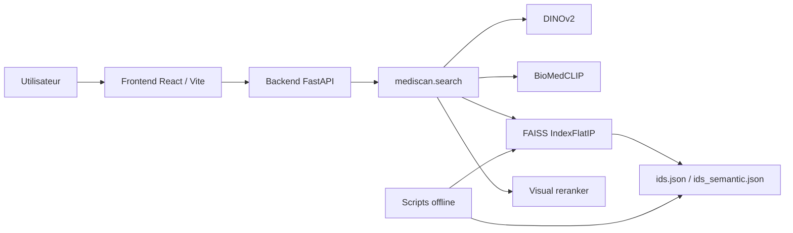

# MEDISCAN CBIR

Guide unique du projet MEDISCAN ; architecture ; contraintes ; fichiers ; scripts ; tests ; commandes

## 0. Demarrage rapide apres un clone

Le depot peut etre clone et demarre localement ; meme si `data/` n'est pas present ; le frontend et le backend peuvent quand meme demarrer

### Installation

```bash
git clone https://github.com/OzanTaskin/mediscan-cbir.git
cd mediscan-cbir
make setup
```

Si tu ne veux pas utiliser `make` :

```bash
python3.11 -m venv .venv
./.venv/bin/pip install -r requirements.txt
cd frontend && npm ci && cd ..
```

Version Python recommandee ; `3.11`

Sur certaines machines ; `python3` peut pointer vers `3.14` ; dans ce cas `pyarrow` peut ne pas avoir de roue precompilee et l'installation peut echouer ; le `Makefile` essaie d'utiliser `python3.11` en priorite lorsqu'il est disponible

### Lancement

Terminal 1 :

```bash
make run-backend
```

Terminal 2 :

```bash
make run-frontend
```

Puis ouvrir :

- frontend ; `http://127.0.0.1:5173/`
- backend ; `http://127.0.0.1:8000/api/health`

### Important

- sans `data/` ; le site se lance ; l'API repond ; mais la recherche reelle et l'affichage des images du corpus ne sont pas disponibles
- avec `data/` ; la recherche fonctionne normalement ; les artifacts de retrieval sont deja versionnes dans le depot
- si les ressources de recherche sont absentes ; l'API renvoie maintenant une erreur explicite au lieu de planter au demarrage

## 1. Objet du projet

MEDISCAN AI est un prototype universitaire de recherche d'images par le contenu en imagerie medicale ; il ne produit aucun diagnostic et ne doit pas etre utilise dans un contexte clinique

Le systeme recoit une image requete ; calcule un embedding ; interroge un index FAISS ; renvoie un top-k d'images similaires avec score ; caption ; CUI

Le projet supporte deux branches :

- `visual` ; recherche par similarite visuelle avec `DINOv2-base` puis reranking low-level
- `semantic` ; recherche par similarite semantique avec `BioMedCLIP`

## 2. Contraintes fortes

- formats d'entree ; `JPEG` et `PNG` uniquement
- `k` borne a `1..50`
- aucune persistance durable de l'image requete
- aucun contenu clinique genere
- execution CPU-only
- reproductibilite sur artefacts stables

## 3. Valeurs et constantes actives

| Element | Valeur |
| --- | --- |
| `MAX_K` | `50` |
| embedder visuel | `dinov2_base` |
| dimension visuelle | `768` |
| embedder semantique | `biomedclip` |
| dimension semantique | `512` |
| index FAISS | `IndexFlatIP` |
| shortlist visuelle avant reranking | `120` |
| poids score FAISS | `0.10` |
| poids pixel | `0.40` |
| poids edges | `0.20` |
| poids coarse silhouette | `0.30` |

## 4. Donnees et artefacts stables

### Donnees

- images stables ; `data/roco_train_full/images`
- metadonnees stables ; `data/roco_train_full/metadata.csv`
- base rapide de travail ; `data/roco_small/`

### Artefacts charges automatiquement

- visuel ; `artifacts/index.faiss`
- mapping visuel ; `artifacts/ids.json`
- semantique ; `artifacts/index_semantic.faiss`
- mapping semantique ; `artifacts/ids_semantic.json`

### Manifestes

- `artifacts/manifests/visual_stable.json`
- `artifacts/manifests/semantic_stable.json`

## 5. Architecture



## 6. Pipeline de bout en bout

### Recherche

1. le frontend envoie une image au backend
2. `POST /api/search` lit `image` ; `mode` ; `k`
3. `SearchService` valide le mode ; `k` ; le type MIME ; le contenu image
4. l'image est ecrite dans un fichier temporaire
5. `mediscan.search.query(...)` charge l'image ; calcule un embedding ; normalise ; interroge FAISS
6. le mode visuel applique un reranking low-level
7. le backend renvoie `mode` ; `embedder` ; `query_image` ; `results`
8. le fichier temporaire est supprime

### Construction offline

1. lecture du CSV metadata
2. ouverture de chaque image
3. calcul des embeddings
4. L2-normalisation
5. construction `IndexFlatIP`
6. ecriture de l'index FAISS
7. ecriture du JSON `ids`

## 7. Structure du depot

### Racine

- `README.md` ; document de reference unique
- `LICENSE` ; licence du depot
- `requirements.txt` ; dependances Python
- `pyproject.toml` ; packaging minimal et configuration `pytest`

### Bibliotheque coeur

- `src/mediscan/`
- `src/mediscan/embedders/`

### Backend

- `backend/app/`

### Scripts

- `scripts/`
- `scripts/evaluation/`
- `scripts/visualization/`

### Frontend

- `frontend/src/`
- `frontend/public/`

### Tests

- `tests/`

## 8. Bibliotheque coeur ; fichier par fichier

### `src/mediscan/__init__.py`

Marque le package Python

### `src/mediscan/process.py`

Petit helper transverse ; fixe les variables d'environnement CPU conservatrices partagees par les scripts et le backend

Fonction :

- `configure_cpu_environment()` ; pose `KMP_DUPLICATE_LIB_OK` et `OMP_NUM_THREADS`

### `src/mediscan/runtime.py`

Centre de configuration du projet

Responsabilites :

- definir `PROJECT_ROOT`
- declarer les modes stables
- fournir les chemins par defaut des artefacts
- resoudre les chemins relatifs
- verifier l'existence des artefacts
- distinguer embedder visuel et semantique
- fixer les threads FAISS

Fonctions :

- `resolve_path(...)`
- `get_mode_config(...)`
- `default_config_for_mode(...)`
- `stable_manifest_path_for_mode(...)`
- `build_embedder(...)`
- `load_indexed_rows(...)`
- `ensure_artifacts_exist(...)`
- `is_visual_embedder(...)`
- `compute_search_k(...)`
- `set_faiss_threads(...)`

### `src/mediscan/search.py`

Coeur du retrieval reutilise par le backend et les scripts

Contenu :

- `MAX_K = 50`
- `SearchResources` ; dataclass contenant `embedder` ; `index` ; `rows`
- `load_resources(...)` ; charge embedder ; index ; metadata ; valide les dimensions
- `query(...)` ; lance la recherche
- `search_image(...)` ; wrapper pratique pour charge + requete

### `src/mediscan/visual_similarity.py`

Reranking specifique au mode visuel

Fonctions :

- `_padded_grayscale(...)`
- `build_visual_signature(...)`
- `rerank_visual_results(...)`

Le but est d'ameliorer la coherence visuelle du top final en combinant :

- score FAISS brut
- similarite pixel
- similarite edges
- similarite coarse

### `src/mediscan/dataset.py`

Chargeur du CSV de metadonnees

Classes :

- `MetadataRecord`
- `RocoSmallDataset`

Le nom est historique ; le chargeur peut aussi servir avec `roco_train_full` tant que le schema est identique

### `src/mediscan/embedders/base.py`

Contrat minimal des embedders

Contenu :

- `safe_int(...)`
- `Embedder` ; classe abstraite avec `encode_pil(...)`

### `src/mediscan/embedders/utils.py`

Refacto utilitaire partagee entre les deux embedders Torch

Fonctions :

- `configure_torch_cpu_threads(...)`
- `normalize_embedding(...)`

### `src/mediscan/embedders/dinov2_base.py`

Implementation visuelle

Classe :

- `DINOv2BaseEmbedder`

Etapes :

- conversion RGB
- preprocess Transformers
- extraction `pooler_output` ou token CLS
- normalisation L2

### `src/mediscan/embedders/biomedclip.py`

Implementation semantique

Classe :

- `BioMedCLIPEmbedder`

Etapes :

- conversion RGB
- preprocess OpenCLIP
- `encode_image(...)`
- normalisation L2

### `src/mediscan/embedders/factory.py`

Registre explicite des embedders supportes ; point unique d'instanciation

### `src/mediscan/embedders/__init__.py`

Re-exports pratiques du sous-package

## 9. Backend ; fichier par fichier

### `backend/__init__.py`

Package marker

### `backend/app/__init__.py`

Package marker

### `backend/app/config.py`

Expose les constantes backend derivees du coeur :

- `MAX_K`
- `ALLOWED_CONTENT_TYPES`
- `ALLOWED_MODES`

### `backend/app/models/schema.py`

Schemas Pydantic :

- `SearchResult`
- `SearchResponse`

### `backend/app/services/search_service.py`

Service d'orchestration backend

Responsabilites :

- normaliser le mode
- valider `k`
- valider le content-type
- verifier que l'image n'est pas vide
- choisir une extension temporaire sure
- verifier que le fichier est une vraie image
- deleguer a `mediscan.search.query(...)`
- supprimer le fichier temporaire

Helpers prives :

- `_normalize_mode(...)`
- `_validate_k(...)`
- `_validate_content_type(...)`
- `_validate_image_bytes(...)`
- `_pick_suffix(...)`
- `_verify_image(...)`

### `backend/app/api/routes.py`

Endpoints :

- `GET /api/health`
- `POST /api/search`
- `GET /api/images/{image_id}`

Helpers :

- `_get_service(...)`
- `_sanitize_image_id(...)`

### `backend/app/main.py`

Point d'entree FastAPI

Ce fichier :

- configure l'environnement CPU
- charge les ressources au demarrage
- construit `SearchService`
- active CORS
- monte le routeur sous `/api`

## 10. Scripts ; fichier par fichier

### `scripts/build_index.py`

Construit un index FAISS et son `ids.json`

Capacites :

- choix de l'embedder
- choix du CSV
- checkpoints optionnels
- reprise de build

Fonctions :

- `parse_args()`
- `_checkpoint_paths(...)`
- `_atomic_write_text(...)`
- `_atomic_save_npy(...)`
- `_load_checkpoint(...)`
- `_save_checkpoint(...)`
- `_maybe_save_checkpoint(...)`
- `main()`

### `scripts/query.py`

CLI de requete

Fonctions :

- `parse_args()`
- `run_query(...)`
- `print_results(...)`
- `export_results_to_csv(...)`
- `main()`

### `scripts/rebuild_stable_indexes.py`

Reconstruit les deux index stables en parallele

Contenu :

- `BuildSpec`
- `build_specs(...)`
- `build_command(...)`
- `_stream_output(...)`
- `launch_build(...)`
- `write_manifest(...)`
- `main()`

### `scripts/evaluation/benchmark.py`

Mesure les temps :

- `tembed`
- `tsearch`
- `tserver`
- `te2e`

Seuils :

- `SEUIL_TE2E_30K = 5.0`
- `SEUIL_STABILITE = 0.20`

### `scripts/evaluation/evaluate_cui.py`

Evaluation retrieval par recouvrement CUI

Seuils :

- `TQ1_SEUILS = {1: 0.80, 2: 0.50, 3: 0.20}`
- `TQ2_SEUILS = {1: 0.30, 2: 0.12, 3: 0.05}`

Fonctions :

- `parse_args()`
- `parse_cui(...)`
- `pick_query_rows(...)`
- `evaluate(...)`
- `compute_tq1(...)`
- `compute_tq2(...)`
- `print_results(...)`
- `save_csv(...)`
- `main()`

### `scripts/evaluation/evaluate_typed.py`

Evaluation typee par categorie de CUI

Mesures :

- `TM` ; modalite
- `TA` ; anatomie
- `TP` ; pathologie

Fonctions :

- `load_categories(...)`
- `split_cui_by_type(...)`
- `parse_cui(...)`
- `pick_query_rows(...)`
- `evaluate(...)`
- `compute_metrics(...)`
- `print_results(...)`
- `_print_metric(...)`
- `save_csv(...)`
- `parse_args()`
- `main()`

### `scripts/visualization/demo_dual_mode_grid.py`

Script de demo qualitative

Fonctions :

- `parse_args()`
- `parse_cui_count(...)`
- `collect_matches(...)`
- `score_visual_query(...)`
- `score_semantic_query(...)`
- `auto_choose_query(...)`
- `find_query_record(...)`
- `resolve_query_for_mode(...)`
- `run_image_search(...)`
- `truncate(...)`
- `load_tile_image(...)`
- `render_grid(...)`
- `main()`

## 11. Frontend ; fichier par fichier

### Config

- `frontend/package.json`
- `frontend/package-lock.json`
- `frontend/vite.config.js`
- `frontend/eslint.config.js`
- `frontend/index.html`

### Application

- `frontend/src/main.jsx` ; monte React
- `frontend/src/App.jsx` ; shell principal ; navigation interne ; providers
- `frontend/src/api.js` ; appels backend
- `frontend/src/index.css` ; theme variables ; styles globaux ; hero mask ; logo handling

### Contextes

- `frontend/src/context/LangContext.jsx` ; provider de langue
- `frontend/src/context/lang-context.js` ; objet `LangContext`
- `frontend/src/context/ThemeContext.jsx` ; provider de theme
- `frontend/src/context/theme-context.js` ; objet `ThemeContext`
- `frontend/src/context/useTheme.js` ; hook `useTheme()`

### Composants actifs

- `Navigation.jsx`
- `LanguageSelector.jsx`
- `HomePage.jsx`
- `SearchPage.jsx`
- `UploadZone.jsx`
- `Controls.jsx`
- `StatusBar.jsx`
- `ResultsGrid.jsx`
- `FeaturesPage.jsx`
- `ContactPage.jsx`
- `HowItWorks.jsx`

### Traductions

- `frontend/src/i18n/en.js`
- `frontend/src/i18n/fr.js`

### Assets encore utilises

- `frontend/public/HomePres.jpg`
- `frontend/public/Logo.png`

## 12. Tests ; fichier par fichier

- `tests/conftest.py` ; note sur la resolution du `pythonpath`
- `tests/test_base_embedder.py` ; contrat abstrait `Embedder`
- `tests/test_factory.py` ; registre des embedders
- `tests/test_runtime.py` ; modes ; artefacts ; `search_k`
- `tests/test_search.py` ; pipeline coeur ; reranking ; preloading
- `tests/test_build_index.py` ; construction nominale ; reprise checkpoint
- `tests/test_query.py` ; forwarding des arguments CLI
- `tests/test_evaluate_cui.py` ; parsing CUI ; `TQ1` ; `TQ2`
- `tests/test_evaluate_typed.py` ; `TM` ; `TA` ; `TP`
- `tests/test_benchmark.py` ; timings ; stats ; erreurs fichier manquant
- `tests/test_demo_dual_mode_grid.py` ; auto-selection ; delegation de recherche
- `tests/test_backend_api.py` ; health ; search ; images
- `tests/test_biomedclip.py` ; embedder semantique mocke ; shape ; normalisation
- `tests/test_dinov2_base.py` ; embedder visuel mocke ; shape ; normalisation

## 13. Commandes utiles

### Backend

```bash
.venv/bin/uvicorn backend.app.main:app --reload
```

### Frontend

```bash
cd frontend
npm install
npm run dev
```

### Rebuild stable

```bash
.venv/bin/python scripts/rebuild_stable_indexes.py
```

### Build manuel d'un index

```bash
.venv/bin/python scripts/build_index.py --embedder dinov2_base --index-path artifacts/index.faiss --ids-path artifacts/ids.json
.venv/bin/python scripts/build_index.py --embedder biomedclip --index-path artifacts/index_semantic.faiss --ids-path artifacts/ids_semantic.json
```

### Requetes

```bash
.venv/bin/python scripts/query.py --mode visual --image data/roco_small/images/<IMAGE>.png --k 10
.venv/bin/python scripts/query.py --mode semantic --image data/roco_small/images/<IMAGE>.png --k 10
```

### Evaluation

```bash
.venv/bin/python scripts/evaluation/evaluate_cui.py --mode visual --k 10 --n-queries 50 --seed 42
.venv/bin/python scripts/evaluation/evaluate_cui.py --mode semantic --k 10 --n-queries 50 --seed 42
.venv/bin/python scripts/evaluation/benchmark.py --mode visual --k 10 --n-queries 10 --n-warmup 2
.venv/bin/python scripts/evaluation/benchmark.py --mode semantic --k 10 --n-queries 10 --n-warmup 2
```

### Demo qualitative

```bash
.venv/bin/python scripts/visualization/demo_dual_mode_grid.py --k 10
```

### Tests

```bash
.venv/bin/python -m pytest -q
```

## 14. Refacto appliquee

La passe de refacto a garde le comportement mais a simplifie plusieurs zones :

- centralisation de l'environnement CPU via `src/mediscan/process.py`
- factorisation de la config Torch et de la normalisation dans `src/mediscan/embedders/utils.py`
- clarification de `SearchService`
- suppression de parametres inutiles dans les scripts d'evaluation
- suppression du code frontend mort
- separation des contextes React pour supprimer le bruit ESLint
- simplification et acceleration des tests d'embedders via mocks

## 15. Validation

Validation attendue apres modifications :

- `cd frontend && npm run lint`
- `cd frontend && npm run build`
- `.venv/bin/pytest -q`
