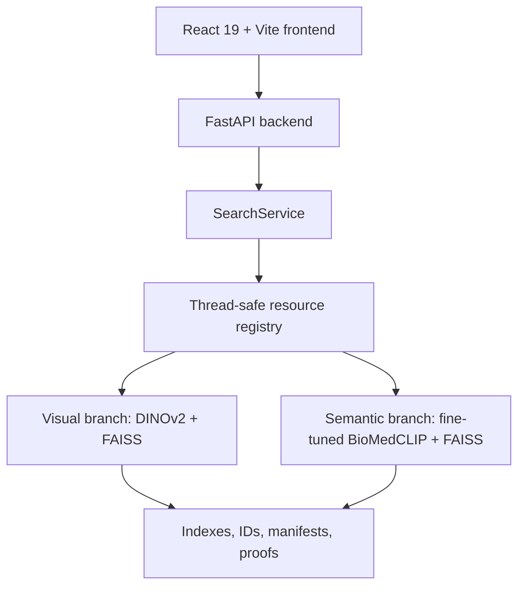

# MediScan AI

<div align="center">
  

  <h3>Multimodal medical image retrieval built as a full AI product prototype.</h3>

  <p>
    <strong>React + FastAPI + FAISS + DINOv2 + fine-tuned BioMedCLIP</strong><br />
    Image-to-image search, semantic retrieval, text-to-image search, relaunch workflows, and evaluated retrieval artifacts.
  </p>

  <p>
    
    
    
    
  </p>

  <p>
    <strong>Non-clinical academic prototype.</strong>
    Built for retrieval research, AI product engineering, and portfolio review.
  </p>
</div>

## Why This Project Stands Out

MediScan AI is not a notebook wrapped in a UI. It is an end-to-end retrieval system with separate model choices for separate user intents, a product-grade frontend, a FastAPI backend, stable FAISS artifacts, and saved evaluation proofs.

It demonstrates:

- multimodal retrieval across image and text inputs
- two complementary embedding strategies instead of a one-model-fits-all shortcut
- a fine-tuned medical image-language model integrated into the runtime
- reproducible FAISS artifacts with manifests and metadata
- strict ground-truth evaluation on modality, anatomy, and modality+organ labels
- a polished bilingual interface designed as a real product surface

## Demo

### Visual Search

Image query -> visual neighbors -> browsable results.

### Text-To-Image Search

Clinical text query -> semantic embedding -> ranked medical images.

## Core Features

| Feature | What it does |
|---|---|
| Visual image search | Retrieves visually similar medical images from a reference image. |
| Semantic image search | Retrieves medically aligned neighbors using a semantic image-language space. |
| Text-to-image search | Turns a clinical text query into a semantic retrieval vector. |
| Search relaunch | Starts a new search from one result or from multiple selected results. |
| AI-assisted synthesis | Generates a clinical-style summary from retrieved evidence. |
| Product UI | Provides result grids, detail views, comparison flows, export paths, themes, and bilingual copy. |

## Retrieval Modes

| Mode | Input | Runtime model | Index | Goal |
|---|---|---|---|---|
| Visual | Image | `facebook/dinov2-base` | `artifacts/index.faiss` | Visual and structural similarity |
| Semantic | Image | `hf-hub:Ozantsk/biomedclip-rocov2-finetuned` | `artifacts/index_semantic.faiss` | Medically meaningful similarity |
| Text | Text | `hf-hub:Ozantsk/biomedclip-rocov2-finetuned` | `artifacts/index_semantic.faiss` | Text-to-image retrieval |

The project deliberately keeps visual retrieval and semantic retrieval separate:

- `facebook/dinov2-base` is used when visual structure, morphology, and image appearance are the main signal.
- `hf-hub:Ozantsk/biomedclip-rocov2-finetuned` is used when medical meaning or language alignment matters.

## Fine-Tuned BioMedCLIP

The semantic branch uses a ROCOv2 fine-tuned BioMedCLIP checkpoint:

```text
hf-hub:Ozantsk/biomedclip-rocov2-finetuned
```

That model powers both:

- semantic image-to-image retrieval
- text-to-image retrieval

The semantic FAISS index was rebuilt with vectors produced by the same fine-tuned checkpoint. This avoids a common retrieval mistake: querying an index with embeddings from a different model space.

| Semantic artifact | Value |
|---|---|
| Manifest | `artifacts/manifests/semantic_stable.json` |
| FAISS index | `artifacts/index_semantic.faiss` |
| IDs metadata | `artifacts/ids_semantic.json` |
| Indexed vectors | `59,962` |
| Embedding dimension | `512` |
| Status | `validated` |

## Performance Snapshot

The repository includes saved proof files under `proofs/perf/`. The strict semantic evaluation filters to images with complete ground-truth labels for modality, organ, and modality+organ.

Ground-truth coverage used by the saved strict evaluation:

| Ground-truth set | Count |
|---|---:|
| Fully annotated image IDs across the 3 CSVs | `12,251` |
| Fully annotated image IDs present in the indexed train split | `9,140` |

### Strict Semantic Retrieval, k=10

Evaluation command used by the project:

```bash
PYTHONPATH=src python scripts/evaluation/evaluate_strict.py \
  --mode semantic \
  --k 10 \
  --n-queries 9140 \
  --seed 42
```

| Semantic setup | TM queries | TA queries | TMO queries | TM results | TA results | TMO results |
|---|---:|---:|---:|---:|---:|---:|
| Recorded semantic baseline | `90.97%` | `90.40%` | `88.58%` | `97.07%` | `95.15%` | `91.42%` |
| Fine-tuned BioMedCLIP ROCOv2 | `91.29%` | `90.70%` | `88.88%` | `96.91%` | `95.22%` | `91.37%` |

Proof files:

- `proofs/perf/eval_strict_semantic_baseline_fullstrict_seed42.csv`
- `proofs/perf/eval_strict_semantic_finetuned_fullstrict_seed42.csv`

Metric meaning:

- `TM`: same modality
- `TA`: same anatomy / organ
- `TMO`: same modality + organ
- `queries`: percentage of queries with at least one matching result
- `results`: percentage of evaluated results matching the label

### Text-To-Image Retrieval, k=10

| Evaluation | Queries | Precision@k | Top-1 hit | Proof |
|---|---:|---:|---:|---|
| Caption-to-image | `100` | `77.0%` | `100.0%` | `proofs/perf/eval_text_caption_seed42_20260421_172657.csv` |
| Keyword-to-image | `100` | `39.3%` | `86.0%` | `proofs/perf/eval_text_keyword_seed42_20260421_172654.csv` |

The keyword evaluation is intentionally conservative: it checks explicit keyword occurrence in captions, so semantically correct results with different wording can be undercounted.

## Architecture



## API Overview

| Endpoint | Purpose |
|---|---|
| `GET /api/health` | Backend health check |
| `POST /api/search` | Image upload retrieval |
| `POST /api/search-text` | Text-to-image retrieval |
| `POST /api/search-by-id` | Relaunch from one indexed image |
| `POST /api/search-by-ids` | Relaunch from multiple selected images |
| `POST /api/generate-conclusion` | AI-assisted synthesis |
| `POST /api/contact` | Contact form delivery |
| `GET /api/images/{image_id}` | Redirect to the public image asset |

## Tech Stack

| Layer | Tools |
|---|---|
| Frontend | React 19, Vite, custom CSS, lucide-react |
| Backend | FastAPI, Pydantic-style schemas, service layer architecture |
| Retrieval | FAISS, DINOv2, BioMedCLIP, OpenCLIP, normalized embeddings |
| Evaluation | Python scripts for strict semantic, typed, CUI, relaunch, and text retrieval checks |
| Artifacts | Git LFS for FAISS indexes and large retrieval assets |

## Quick Start

### Prerequisites

- Python `3.11`
- Node.js `>=20.19.0` or `>=22.12.0`
- npm
- Git LFS

### Clone

```bash
git clone https://github.com/MediscanAI-cbir/mediscan-cbir.git
cd mediscan-cbir
git lfs install
git lfs pull
```

### Configure

```bash
cp .env.example .env
```

Optional AI synthesis:

```env
GROQ_KEY_API=your_groq_api_key_here
```

### Run

macOS / Linux:

```bash
chmod +x run.sh
./run.sh
```

Windows:

```bat
run.bat
```

Open:

- Frontend: `http://127.0.0.1:5173`
- Backend: `http://127.0.0.1:8000`
- Health check: `http://127.0.0.1:8000/api/health`

## Developer Commands

Frontend:

```bash
cd frontend
npm ci
npm run dev
npm run lint
npm run build
```

Backend:

```bash
python3.11 -m venv .venv311
source .venv311/bin/activate
pip install -r requirements.txt
PYTHONPATH=src uvicorn backend.app.main:app --host 127.0.0.1 --port 8000
```

Tests:

```bash
pytest
```

Evaluation examples:

```bash
PYTHONPATH=src python scripts/evaluation/evaluate_strict.py --mode semantic --k 10 --n-queries 9140 --seed 42
PYTHONPATH=src python scripts/evaluation/evaluate_text.py --mode both --k 10 --n-queries 100 --seed 42
```

The strict evaluator expects the modality, organ, and modality+organ CSV files under `artifacts/ground_truth/`. Saved proof exports are already available under `proofs/perf/`.

## Repository Structure

```text
.
|-- backend/              FastAPI app, routes, services, validation
|-- frontend/             React product interface
|-- src/mediscan/         Retrieval runtime, embedders, indexing helpers
|-- artifacts/            FAISS indexes, ID metadata, manifests
|-- proofs/perf/          Saved evaluation proof CSVs
|-- scripts/evaluation/   Retrieval evaluation scripts
|-- scripts/visualization Demo grid generation utilities
|-- tests/                Python test suite
|-- run.sh                macOS / Linux one-command launcher
`-- run.bat               Windows one-command launcher
```

## What This Demonstrates

MediScan AI shows the full path from model selection to product experience:

- choosing the right embedding family for the retrieval task
- maintaining model/index consistency through manifests
- designing a usable interface around dense retrieval workflows
- exposing retrieval through a clean API instead of ad hoc scripts
- validating retrieval behavior with saved ground-truth evaluation proofs
- packaging the project so it can be reviewed, run, and explained

## Disclaimer

MediScan AI is a non-clinical academic prototype. It is intended for experimentation, retrieval research, interface design, and AI product engineering demonstration. It must not be used as a medical device or as a substitute for clinical judgment.
